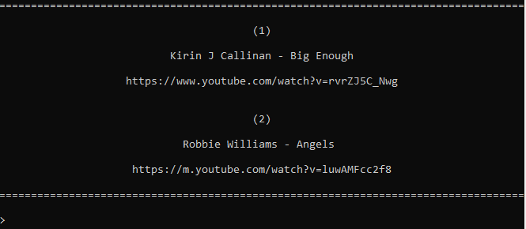

# Lekker rangschikken!
_Script written by [Davey Struijk](https://github.com/daveystruijk)_

Simple script to help ranking music lists!

## Getting started

1. Clone this repository
2. Open terminal in the root folder and run: `python run.py`

## How to use the script

1. The terminal will display a choice between two songs

2. Type `1` or `2` to select the song that you think is best and press `Enter`
3. The program will select two new songs from the list at random
4. You can exit this loop by pressing `Ctrl+C`
5. A sorted list based on your music preferences will be written to `keldertoplijst2022.csv`

You can continue sorting your list anytime by restarting the program. Your last sorted list will be taken as a starting point.
